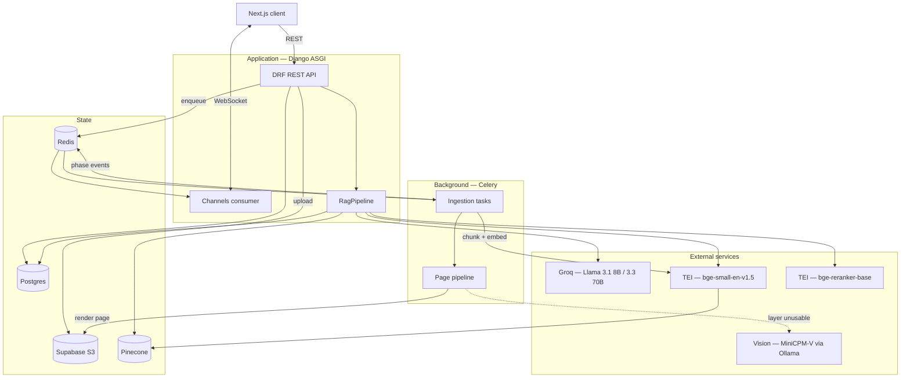
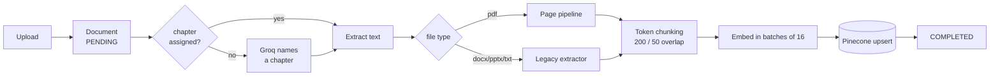
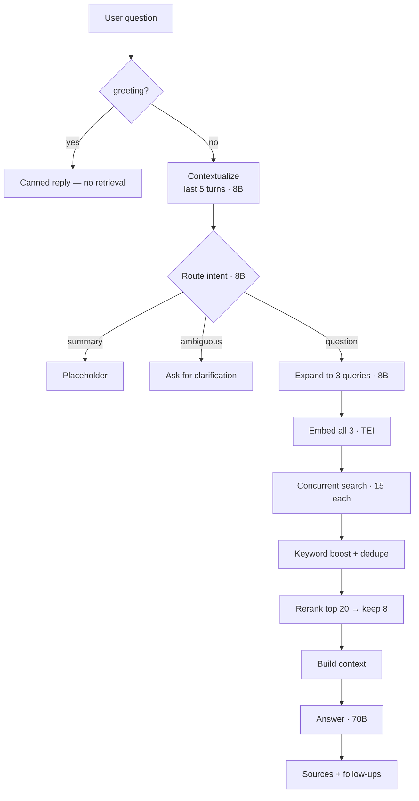

# RagBag — RAG Knowledge Assistant (Backend)

A Django backend for an AI study workspace. Upload a textbook — including one you
photographed with your phone — and read it, question it, and revise from it, with every
answer grounded in the pages you actually uploaded.

**Django 5.2 · DRF · Channels (ASGI) · Celery · Redis · Postgres · Pinecone · TEI · Groq (Llama 3)**

> This repository is the backend. The Next.js client lives in
> [RagBag-frontend](https://github.com/Abhishekvoid/RagBag-frontend).

The interesting problem here isn't retrieval-augmented generation — that's well-trodden.
It's that **a scanned page is not text, and pretending otherwise quietly corrupts
everything downstream.** A chunk built from garbled OCR still embeds, still retrieves, and
still gets cited with total confidence. So this system treats transcription uncertainty as
a first-class data type: pages the text layer can't be trusted for are rebuilt by a vision
model that marks every word it isn't sure of, and the original scan is kept alongside so a
reader can check the machine's work.

---

## Contents

- [What it does](#what-it-does)
- [Architecture](#architecture)
- [Reading pages that aren't text](#reading-pages-that-arent-text) — the core idea
- [Ingestion pipeline](#ingestion-pipeline)
- [Retrieval pipeline](#retrieval-pipeline)
- [Study generation](#study-generation)
- [Resilience layer](#resilience-layer)
- [Real-time ingestion status](#real-time-ingestion-status)
- [Data model](#data-model)
- [API surface](#api-surface)
- [Design decisions](#design-decisions)
- [Performance characteristics](#performance-characteristics)
- [Known limitations](#known-limitations)
- [Running locally](#running-locally)
- [Configuration](#configuration)
- [Tests](#tests)
- [Repository layout](#repository-layout)
- [Deployment](#deployment)

Code excerpts below are real, pinned to
[`786a657`](https://github.com/Abhishekvoid/RagBag-backend/tree/786a657ad19dd1eed68e3379638663a8a454fec1).
Where a block is abridged for length, it says so and links to the full source.

---

## What it does

| Capability | How it actually works |
|---|---|
| **Page-aware ingestion** | Every PDF page is rendered to an image and stored. Text comes from the page's own text layer, or from a vision model when that layer can't be trusted |
| **Uncertainty-marked transcription** | The vision model wraps every low-confidence word as `[?word]`; fully illegible words become `[?]`. Markers survive into the reader and are stripped before embedding |
| **Provenance per page** | Each page records whether its text came from the PDF layer, the vision model, or a fallback — so you always know how a given sentence was obtained |
| **Retrieval pipeline** | History-aware rewriting → intent routing → 3-way query expansion → concurrent vector search → keyword boost → dedupe → cross-encoder rerank |
| **Tiered generation** | A fast 8B model runs the pipeline's five utility calls; a 70B model writes the one answer the user reads |
| **Grounded answers** | Responses carry source chips resolved to document titles, plus generated follow-up questions |
| **Study automation** | Flashcards, practice questions, passage explanation, note synthesis, and notes → flashcards, all chapter-scoped |
| **Live ingestion status** | Eight named phases pushed over WebSocket with per-page and per-batch counters |
| **Graceful degradation** | Redis circuit breakers, bounded concurrency, and a defined fallback for every external dependency |
| **Multi-tenancy** | UUID keys throughout; every vector query is filtered by owner, and the owner filter is never relaxed |

---

## Architecture



Two processes run the system: an ASGI web service handling HTTP and WebSockets, and a
Celery worker doing ingestion. They share Postgres, Redis, and — importantly — circuit
breaker state, so when Groq starts failing, the worker and the API find out at the same
moment.

---

## Reading pages that aren't text

A PDF exported from LaTeX and a photograph of a library book are both `application/pdf`.
The first has a perfect text layer. The second has none, or worse, has a bad one: some
scanners embed their own low-quality OCR, so `extract_text()` returns *something* — just
not something true.

**Presence is not quality.** So the first decision is whether to believe the page at all:

[`accounts/vision_ocr.py`](https://github.com/Abhishekvoid/RagBag-backend/blob/786a657ad19dd1eed68e3379638663a8a454fec1/accounts/vision_ocr.py#L41-L48)

```python
_MIN_LAYER_CHARS = 40
_MIN_ALNUM_RATIO = 0.55

def page_needs_vision(layer_text: str) -> bool:
    """True when the PDF's own text layer is too sparse or too garbled to trust,
    so the page should be sent to the vision model instead."""
    text = (layer_text or "").strip()
    if len(text) < _MIN_LAYER_CHARS:
        return True
    alnum = sum(c.isalnum() or c.isspace() for c in text)
    return (alnum / len(text)) < _MIN_ALNUM_RATIO
```

Two cheap signals, no model call: too little text, or too much of it is punctuation
soup. It's a pure function, which is why it's the easiest part of the pipeline to test.

### Making the model admit what it can't read

A transcription model asked to read a blurry page will produce fluent, confident,
*invented* text. That is the failure mode that matters, because invented text is
indistinguishable from real text once it's a vector. The prompt therefore makes
uncertainty representable:

[`accounts/vision_ocr.py`](https://github.com/Abhishekvoid/RagBag-backend/blob/786a657ad19dd1eed68e3379638663a8a454fec1/accounts/vision_ocr.py#L64-L72)

```python
_SYSTEM = (
    "You transcribe a single scanned or photographed page (printed or handwritten) "
    "into clean, faithful Markdown. Rules: reproduce the page's real words — never "
    "invent facts, sentences, or data that are not visibly on the page. Use Markdown "
    "headings and bullet points to match the page's structure. For any word you cannot "
    "read with confidence, keep your best guess wrapped in [?like_this]; if a word is "
    "fully illegible, write [?]. Output only the Markdown transcription — no commentary, "
    "no page numbers of your own, no code fences around the whole thing."
)
```

Called at `temperature=0` — this is transcription, not writing.

### The marker earns its keep three times

`[?mitochondria]` is one annotation serving three different consumers:

| Consumer | Treatment | Why |
|---|---|---|
| Reader UI | Rendered as a tappable marker that reveals the original scan | The human resolves what the model couldn't |
| Embeddings | Stripped to `mitochondria` before chunking | A marker in a vector is noise; the best guess is still the best signal |
| Provenance | Page records `text_source = vision` | You can tell reconstructed pages from born-digital ones |

```python
_MARKER_RE = re.compile(r"\[\?([^\]]*)\]")

def strip_uncertainty_markers(md: str) -> str:
    """Turn inline ``[?word]`` uncertainty markers back into plain ``word`` for
    embedding and quote-matching (the markers are a reader-only affordance)."""
    return _MARKER_RE.sub(r"\1", md or "")
```

And the rendered page image is kept permanently, not discarded after transcription:

[`accounts/models.py`](https://github.com/Abhishekvoid/RagBag-backend/blob/786a657ad19dd1eed68e3379638663a8a454fec1/accounts/models.py#L117-L139)

```python
class DocumentPage(models.Model):
    """One page of a document's canonical, reader-facing text.

    ``reconstructed_md`` is the clean markdown shown in the reader and used for
    RAG/flashcards/questions. ``image_url`` is the rendered original page, kept
    as a verification layer for the AI's ``[?word]`` uncertainty markers.
    """
    SOURCE_LAYER = 'layer'       # born-digital: used the PDF's own text layer
    SOURCE_VISION = 'vision'     # reconstructed by the vision model
    SOURCE_FALLBACK = 'fallback' # vision unavailable/failed: tesseract or raw layer
```

That image is the whole point. Every other AI reading tool asks you to trust its
transcription. This one keeps the receipt.

---

## Ingestion pipeline



The per-page loop is the heart of it — render, decide, reconstruct or accept, persist,
report progress:

[`accounts/page_pipeline.py` · `build_document_pages`](https://github.com/Abhishekvoid/RagBag-backend/blob/786a657ad19dd1eed68e3379638663a8a454fec1/accounts/page_pipeline.py#L51-L89)

```python
for idx, png in enumerate(images):
    page_number = idx + 1
    layer = layer_texts[idx] if idx < len(layer_texts) else ""

    use_vision = (
        VISION_ENABLED
        and page_number <= VISION_MAX_PAGES
        and page_needs_vision(layer)
    )
    image_url = store_page_image(document, page_number, png)

    if use_vision:
        try:
            md = reconstruct_page_markdown(png, page_number=page_number)
            source = DocumentPage.SOURCE_VISION
        except VisionUnavailable:
            md = layer.strip()
            source = DocumentPage.SOURCE_FALLBACK
    else:
        md = layer.strip()
        source = DocumentPage.SOURCE_LAYER

    DocumentPage.objects.update_or_create(
        document=document, page_number=page_number,
        defaults={"image_url": image_url, "reconstructed_md": md, "text_source": source},
    )
    push_ingestion_status(document.user_id, document.id, PHASE_PAGE,
                          page=page_number, total_pages=total)
```

Three things worth noting:

- **`update_or_create` keyed on `(document, page_number)`** makes re-scanning idempotent.
  The `documents/<id>/rescan/` endpoint re-runs this loop over an existing document —
  useful when you enable vision after the fact — and pages are replaced, not duplicated.
- **Vision failure degrades to the layer text**, it doesn't abort the document. One
  unreachable Ollama host costs you transcription quality on some pages, not the upload.
- **`VISION_MAX_PAGES`** bounds cost on a 600-page book.

Chunking is a deliberately boring sliding window over tokens:

[`accounts/tasks.py`](https://github.com/Abhishekvoid/RagBag-backend/blob/786a657ad19dd1eed68e3379638663a8a454fec1/accounts/tasks.py#L123-L135)

```python
def chunk_text_by_token(text, tokenizer, chunk_size=200, chunk_overlap=50):
    tokens = tokenizer.encode(text)          # tiktoken, cl100k_base
    chunks, start = [], 0
    while start < len(tokens):
        chunks.append(tokenizer.decode(tokens[start:start + chunk_size]))
        start += chunk_size - chunk_overlap
    return chunks
```

200 tokens with 50 overlap, against a 384-dimension embedding model. Small chunks
retrieve precisely; the overlap keeps a sentence that straddles a boundary recoverable.
Semantic chunking was not worth the extra LLM pass here — textbook pages already carry
structure, and the reranker fixes ordering mistakes more cheaply than a smarter splitter
would prevent them.

Embedding runs in batches of 16 with each chunk length-bounded, and ingestion refuses to
silently succeed on nothing:

```python
if not doc.extracted_text.strip():
    raise ValueError("No text available for ingestion.")
...
if not text_chunks:
    raise ValueError("Text could not be split into chunks.")
```

The document goes `FAILED` with a stored `error_message` and the failure reaches the UI,
rather than a `COMPLETED` document that answers every question with "I don't know."

---

## Retrieval pipeline



### Cheap questions get cheap answers

Before any retrieval happens, two filters run. `is_greeting` is a regex that collapses
repeated characters first, so `hiiiii` matches `hi` — a trivial touch that stops "hey!"
from costing a full RAG round-trip. Then an 8B router classifies intent, and only
`question` reaches the retrieval path.

### Retrieval widens scope, but never trust boundaries

[`accounts/rag_pipeline.py` · `handle_rag_search`](https://github.com/Abhishekvoid/RagBag-backend/blob/786a657ad19dd1eed68e3379638663a8a454fec1/accounts/rag_pipeline.py#L534-L558)

```python
search_filter = {
    "user_id": {"$eq": str(user_id)},
    "chapter_id": {"$eq": str(chapter_id)},
}

async with latency_tracker.track_async("vector_search"):
    flat_results = await search_vectors(
        all_embeddings, filter=search_filter, limit_per_vector=15,
    )

if not flat_results:
    logger.warning("Strict filter failed → fallback to user_id only")
    fallback_filter = {"user_id": {"$eq": str(user_id)}}
    flat_results = await search_vectors(
        all_embeddings, filter=fallback_filter, limit_per_vector=15,
    )
```

Read that fallback carefully: it drops `chapter_id`, never `user_id`. A chapter
mis-association degrades into a wider search across **that user's own** documents. The
tenant boundary is not a filter that can be relaxed — it's the one condition present in
both branches.

The three expanded queries are embedded together and searched concurrently
(`asyncio.gather` in `rag_service.search_vectors`), so query expansion costs one round of
latency, not three.

### Reranking is an enhancement, not a dependency

[`accounts/rag_pipeline.py`](https://github.com/Abhishekvoid/RagBag-backend/blob/786a657ad19dd1eed68e3379638663a8a454fec1/accounts/rag_pipeline.py#L606-L625)

```python
if len(unique_results) > 5:
    RERANK_LIMIT = min(len(unique_results), 20)
    candidates = unique_results[:RERANK_LIMIT]

    async with latency_tracker.track_async("reranking"):
        scores = await rerank_client.rerank(query, [r.payload["text"] for r in candidates])

    if scores:
        for r, s in zip(candidates, scores):
            r.score = float(s)
        final_results = sorted(candidates, key=lambda x: x.score, reverse=True)[:8]
    else:
        # Rerank service unavailable — keep the vector + keyword order.
        logger.warning("Rerank unavailable; falling back to vector ordering")
        final_results = unique_results[:8]
else:
    final_results = unique_results[:8]
```

Dedupe happens *before* reranking, and the window is capped at 20, so the cross-encoder
never sees the full result set. Fewer than 5 results skips reranking entirely — there's
nothing to reorder. And `rerank()` returns `None` rather than raising, which is what makes
the whole block degrade instead of fail.

### Two models, one pipeline

Five LLM calls happen per question: contextualize, route, expand, generate follow-ups, and
answer. Only the last one is read by a human.

```python
LLM_MODEL    = "llama-3.1-8b-instant"     # contextualize · route · expand · follow-ups
ANSWER_MODEL = "llama-3.3-70b-versatile"  # the one answer the user reads
```

```python
chat_completion = await ask_llm(
    self.groq_client,
    messages=answer_messages,
    model=ANSWER_MODEL,
    temperature=0.4,      # natural prose, not robotic
    max_tokens=1500,      # room for adaptive length
    timeout=45.0,
)
```

Query rewriting doesn't need a 70B model; prose a student will read does. Splitting them
keeps the four plumbing calls fast and cheap without capping answer quality.

Every failure point in this pipeline returns a sentence a user can act on — "AI is
temporarily unavailable. Please try again shortly." — rather than a 500.

---

## Study generation

Beyond chat, chapter content drives flashcards, practice questions, passage explanation,
note synthesis, and notes→flashcards. These run as synchronous DRF views, so they share
the circuit breaker through a sync mirror of the async gateway:

[`accounts/views.py`](https://github.com/Abhishekvoid/RagBag-backend/blob/786a657ad19dd1eed68e3379638663a8a454fec1/accounts/views.py#L53-L67)

```python
def _guarded_groq(messages, *, json_mode):
    """Sync Groq call wrapped in the shared circuit breaker (mirrors the async
    llm_gateway used by the RAG pipeline, but for these sync HTTP views)."""
    if groq_client is None:
        raise LLMUnavailable("LLM client is not configured.")
    if not llm_circuit_breaker.allow_request():
        raise LLMUnavailable("LLM is temporarily unavailable. Please retry shortly.")
    ...
```

Because breaker state lives in Redis, a Groq outage detected by the async RAG pipeline
already has the sync flashcard endpoint refusing fast — across processes, without shared
memory.

The generation prompts are constrained rather than open-ended. Explanation, for instance,
is bounded in length, in reading level, and in what it's allowed to know:

```python
prompt = (
    "You are a patient tutor. Explain the following passage clearly and "
    "concisely for a student, in 2-4 sentences. Use plain language; do not "
    "add information beyond what the passage supports.\n\nPASSAGE:\n"
    f"{passage[:4000]}\n\nEXPLANATION:"
)
```

"Do not add information beyond what the passage supports" is the same constraint as the
vision prompt's "never invent facts," applied at a different layer. The result is
persisted as a `kind=ai` note anchored to the quoted passage, so an explanation stays
attached to what it explains.

These endpoints get their own throttle bucket — `30/hour` against the general `100/hour` —
because they're the expensive ones.

---

## Resilience layer

Every external call is wrapped in the same four protections. The async LLM path composes
them in one place:

[`utils/llm_gateway.py` · `ask_llm`](https://github.com/Abhishekvoid/RagBag-backend/blob/786a657ad19dd1eed68e3379638663a8a454fec1/utils/llm_gateway.py#L14-L77)

```python
async def ask_llm(groq_client, messages, *, model, json_mode=False, **kwargs):
    if llm_circuit_breaker.is_open():                  # 1. don't call a dead service
        logger.warning("LLM circuit OPEN - blocking request")
        raise LLMUnavailable("LLM temporarily unavailable")
    try:
        async with llm_slot_manager.slot():            # 2. bounded concurrency + queue
            response = await _call_llm_with_retry(     # 3. tenacity, exponential jitter
                groq_client, messages=messages, model=model, json_mode=json_mode, **kwargs
            )
            # ... token accounting via cost_tracker
            llm_circuit_breaker.record_success()
            return response
    except SystemOverload:                             # 4. shed load rather than queue it
        raise LLMUnavailable("system under heavy load")
    except Exception:
        llm_circuit_breaker.record_failure()
        logger.exception("LLM call failed", extra={...})
        raise
```

### The breaker lives in Redis, not in the process

[`utils/circuit_breaker.py`](https://github.com/Abhishekvoid/RagBag-backend/blob/786a657ad19dd1eed68e3379638663a8a454fec1/utils/circuit_breaker.py)

```python
class CircuitBreaker:
    def __init__(self, service_name: str, failure_threshold=3, cooldown=60):
        self.key = f"cb:{service_name}"
        ...

    def is_open(self) -> bool:
        data = redis_client.hgetall(self.key)
        if not data:
            return False
        if data.get("state") == "open":
            opened_at = float(data.get("opened_at", 0))
            if time.time() - opened_at > self.cooldown:
                redis_client.hset(self.key, "state", "half-open")   # probe once
                return False
            return True
        return False
```

An in-memory breaker in a multi-process deployment is close to useless: two Gunicorn
workers and a Celery worker each learn the service is down independently, each burning
their own failure budget. Putting the state in a Redis hash means the third failure
anywhere opens the circuit everywhere. `record_success()` deletes the key outright — a
successful probe after cooldown is a full reset, not a decrement.

### Backpressure: refuse fast instead of queueing forever

[`utils/llm_load_control.py`](https://github.com/Abhishekvoid/RagBag-backend/blob/786a657ad19dd1eed68e3379638663a8a454fec1/utils/llm_load_control.py)

```python
@asynccontextmanager
async def slot(self):
    async with self._lock:
        if self._waiting >= self.max_queue:
            raise SystemOverload("system is overloading, try again later")
        self._waiting += 1
    try:
        async with self._semaphore:
            yield
    finally:
        async with self._lock:
            self._waiting -= 1

tei_slot_manager = SlotManager(3, 5)      # embeddings: 3 concurrent, 5 queued
llm_slot_manager = SlotManager(20, 100)   # generation: 20 concurrent, 100 queued
```

A bare semaphore bounds concurrency but lets the waiting line grow without limit — under
load you get a queue of requests whose clients timed out long ago. Counting waiters and
rejecting past a threshold converts an unbounded latency problem into an immediate,
honest error. TEI gets far tighter limits than Groq because it's a single self-hosted
container, not an elastic API.

### Every dependency has a defined fallback

| Dependency | On failure | User-visible effect |
|---|---|---|
| Vision model | Fall back to the PDF text layer, mark page `fallback` | Lower transcription quality on affected pages |
| Reranker | `rerank()` returns `None`; keep vector + keyword order | Slightly worse chunk ordering |
| Contextualizer | Use the raw query | Follow-ups may resolve less well |
| Router | Default to `question` | Retrieval runs when it might not have needed to |
| Embeddings | Breaker opens after 3 failures; 5 retries with jitter | Ingestion fails loudly, document marked `FAILED` |
| Answer LLM | `LLMUnavailable` → plain-language message | "AI is temporarily unavailable. Please try again shortly." |

The rule: anything that improves an answer may fail silently; anything that *is* the
answer fails loudly.

### Instrumentation

`utils/metrics/` holds three collectors wired into the pipeline: `StageLatencyTracker`
(rolling window, count/avg/p95/p99 per stage), `CostTracker` (thread-safe daily token and
cost accumulation, priced per model), and `RetrievalEvaluator` (keyword-overlap relevance
on returned chunks). Pipeline stages are wrapped in `latency_tracker.track_async("stage")`,
and each request carries a `request_id` through structured `rag_request_started` /
`rag_request_completed` log events with total latency.

---

## Real-time ingestion status

Ingestion takes minutes on a large book. A spinner is not an acceptable answer, so the
pipeline reports a structured phase event at every step:

[`accounts/realtime.py`](https://github.com/Abhishekvoid/RagBag-backend/blob/786a657ad19dd1eed68e3379638663a8a454fec1/accounts/realtime.py)

```python
PHASE_READING, PHASE_NAMING, PHASE_PAGE, PHASE_CHUNKING = "reading", "naming", "page", "chunking"
PHASE_EMBEDDING, PHASE_STORING, PHASE_READY, PHASE_FAILED = "embedding", "storing", "ready", "failed"

def push_ingestion_status(user_id, document_id, phase, **extra) -> dict:
    """Build and broadcast an ingestion_status event to the user's group.
    Never raises — a telemetry failure must not break ingestion."""
    payload = build_ingestion_status(document_id, phase, **extra)
    try:
        async_to_sync(get_channel_layer().group_send)(
            f"user_{user_id}", {"type": "send_notification", "data": payload},
        )
    except Exception as e:
        logger.warning("push_ingestion_status failed (%s): %s", phase, e)
    return payload
```

Two deliberate properties:

- **It never raises.** A Redis hiccup in the channel layer must not fail an ingestion that
  otherwise succeeded. Telemetry is not allowed to break the thing it observes.
- **Optional keys are omitted when `None`**, so the frontend reducer can treat a missing
  key as "unchanged" and merge partial updates without clobbering state.

`build_ingestion_status` is a pure function, separated from the broadcast specifically so
the payload contract can be unit-tested without a channel layer.

WebSocket connections authenticate by JWT in the query string via custom Channels
middleware, and each user joins their own group — `user_<id>` — so status for your
documents reaches only you.

---

## Data model

Every primary key is a UUID.

```text
CustomUserModel                       email as username
 └─ Subject                           optional grouping
      └─ Chapter                      the scope for everything below
           ├─ Document                PENDING → PROCESSING → COMPLETED | FAILED
           │    └─ DocumentPage       page_number · image_url · reconstructed_md · text_source
           ├─ Note                    user notes, scratch pad, and kind=ai explanations
           ├─ GenerateQuestion        practice questions
           └─ GenerateFlashCards      known / need_review state
 └─ ChatSession
      └─ ChatMessage                  sender · text · citations · suggestions · tokens · error
```

Chapters may have no subject. Rather than forcing a taxonomy on someone who just wants to
upload a PDF, the API synthesizes an "Uncategorized" section for them.

`DocumentPage` carries `unique_together = (document, page_number)`, which is what makes
re-scanning idempotent, and orders by `page_number` so a reader never has to sort.

---

## API surface

All routes are mounted under `auth/`. JWT required unless noted.

| Method | Path | Purpose |
|---|---|---|
| `POST` | `register/` · `oauth-signin/` | Email registration · Google sign-in |
| `GET` | `me/` | Current user |
| `GET POST` | `subjects/` · `chapters/` | List / create |
| `GET PATCH DELETE` | `subjects/<id>/` · `chapters/<id>/` | Detail, cascade delete |
| `GET POST` | `documents/` | List · multipart upload (dispatches ingestion) |
| `GET PATCH DELETE` | `documents/<id>/` | Detail |
| `GET` | `documents/<id>/pages/` | Reconstructed pages with image urls |
| `GET` | `documents/<id>/content/` | Canonical text, markers stripped |
| `POST` | `documents/<id>/rescan/` | Re-run the page pipeline (idempotent) |
| `POST` | `documents/<id>/retry/` | Retry a failed ingestion |
| `POST` | `rag-chat/` | **Main chat endpoint** |
| `GET` | `chapters/<id>/messages/` | Paginated history, newest first |
| `POST` `GET` | `chapters/<id>/generate-questions/` · `questions/` | Generate · list |
| `POST` `GET` | `chapters/<id>/generate-flashcards/` · `flashcards/` | Generate · list |
| `GET PATCH DELETE` | `flashcards/<id>/` | Known / needs-review toggles |
| `GET POST` | `chapters/<id>/notes/` | Notes |
| `GET PATCH DELETE` | `notes/<id>/` | Note detail |
| `GET PUT` | `chapters/<id>/scratch/` | Scratch pad |
| `POST` | `chapters/<id>/explain/` | Explain a passage → persisted AI note |
| `POST` | `chapters/<id>/notes-to-flashcards/` | Batch notes into flashcards |
| `POST` | `chapters/<id>/synthesize-notes/` | Synthesize notes into a summary |
| `GET POST` | `chatsessions/` · `chatsessions/<id>/` | Session list / detail |
| `WS` | `ws/notifications/?token=<jwt>` | Ingestion status stream |
| `GET` | `/ping/` | Health check (unauthenticated) |

`rag-chat/` gates on readiness before doing anything expensive: the chapter's latest
document must be `COMPLETED`, otherwise it returns `409` while processing — which the
client renders as "still processing" instead of an error.

Auth is JWT with 15-minute access tokens, 7-day refresh, rotation and blacklisting on
logout. Throttling: `10/hour` anonymous, `100/hour` authenticated, `30/hour` for the AI
note endpoints. Uploads are capped at 50 MB and restricted by extension.

---

## Design decisions

**Pinecone serverless over self-hosted Qdrant.** Qdrant came first. The client surface
kept moving between versions (`search()` vs `query_points()`), payload indexes had to be
created defensively on every ingest, and self-hosting meant another stateful service to
run, secure and pay for — for a workload whose vector count is small. Pinecone serverless
deleted the component: the index is created lazily on first use, metadata fields are
indexed automatically, and there's no capacity to manage. The trade is control and
portability for one fewer thing that can break unattended.

**Embeddings and reranking as separate TEI services.** The deployed image ships no
`torch`, no `transformers`, no `sentence-transformers`. An in-process cross-encoder means
a multi-gigabyte image, slow cold starts, and a model competing with request handling for
the same CPU. Two HTTP calls to TEI containers keeps the app image small and lets the
model tier scale — or fail — independently of the API.

**PyMuPDF for rendering, not pdf2image.** `pdf2image` needs `poppler-utils` installed at
the OS level, which rules out plain Python runtimes on most PaaS. PyMuPDF renders with no
external binary. Chosen for deployability, not speed.

**Redis-backed circuit breakers.** Detailed above: an in-memory breaker doesn't work when
the web service and the worker are different processes.

**Two Llama models rather than one.** Four of five per-question LLM calls are internal
plumbing whose output no human sees. Paying 70B latency and cost for query rewriting is
waste; paying 8B quality for the answer is a worse product. Split them.

**Uncertainty as a data type.** The alternative — a confidence score on the page, or
nothing at all — can't be acted on. A marker at the exact word, plus the stored scan,
gives the reader a way to resolve it.

---

## Performance characteristics

No latency table is published here. Numbers from one developer machine, against a free
Groq tier and a local CPU-bound TEI container, wouldn't transfer to your deployment, and a
table nobody can reproduce is worse than none.

What *is* fixed by design, and checkable in the source:

| Knob | Value | Where |
|---|---|---|
| Chunk size / overlap | 200 / 50 tokens (`cl100k_base`) | `tasks.py` |
| Max chunks per document | 1000 | `tasks.py` |
| Embedding batch | 16 chunks | `tasks.py` |
| Embedding dimension | 384 (validated on every response) | `tei_embedding.py` |
| Results per query vector | 15 | `rag_pipeline.py` |
| Expanded queries | 3, embedded together, searched concurrently | `rag_pipeline.py` |
| Rerank window | ≤ 20 candidates → top 8 kept | `rag_pipeline.py` |
| LLM concurrency | 20 concurrent, 100 queued | `llm_load_control.py` |
| TEI concurrency | 3 concurrent, 5 queued | `llm_load_control.py` |
| Circuit breaker | 3 failures, 60s cooldown | `circuit_breaker.py` |
| Retries | 5 (embeddings) · 3 (LLM, rerank), exponential jitter | `tei_embedding.py`, `llm_wrapper.py` |
| Timeouts | 10s TEI · 10s rerank · 45s answer generation | env / `rag_pipeline.py` |

To measure your own: every pipeline stage is wrapped in
`latency_tracker.track_async(stage)`, and `StageLatencyTracker.get_metrics()` returns
count, average, p95 and p99 per stage over a 5000-sample rolling window.

Where the time goes, structurally: one embedding round-trip and one concurrent vector
search regardless of expansion count, one rerank call over ≤20 short texts, and one 70B
generation. The generation dominates; the retrieval stages are deliberately arranged so
they don't compound.

---

## Known limitations

Written as they are, with the fix identified.

**Scanned PDFs need the vision pass enabled.** The PDF path resolves text as: layer →
vision → layer. Tesseract still lives in the legacy extractor (`get_text_from_file`),
which is now reached only for `docx`/`pptx`/`txt`, so a scanned PDF with
`VISION_ENABLED=false` produces empty pages and fails ingestion with "No text available"
— loudly and with a stored error, but it fails. *Fix: call Tesseract as the
`VisionUnavailable` branch inside `build_document_pages`, making `SOURCE_FALLBACK` a real
OCR attempt rather than a re-use of the layer text.*

**Page numbers on chunks are approximate.** `_page_for_chunk` substring-matches a chunk's
first 40 characters against each page's markdown to tag it. Chunks that span a page
boundary, or that begin with repeated boilerplate, can be attributed to the wrong page.
Acceptable today because source chips are document-level and page numbers are advisory.
*Fix: chunk per page and carry `page_number` forward, instead of recovering it afterward.*

**Summary intent is a placeholder.** The router correctly classifies "summarize this
chapter," and then `handle_summary` returns a stub string. *Fix: map-reduce over
`DocumentPage.reconstructed_md` — summarize per page, then combine — which the page model
already makes straightforward.*

**Answers are not streamed.** `rag-chat/` is a synchronous DRF endpoint returning the
complete answer, so the user waits through the full 70B generation with no partial output.
*Fix: stream tokens over the WebSocket that already exists for ingestion status.*

**Retrieval fallback widens chapter scope.** When the strict filter returns nothing, the
search retries with `user_id` only. This is intentional and never crosses tenant
boundaries, but it can return a chunk from a different chapter of the same user's library
without the answer flagging that it did. *Fix: mark fallback results in the response so
the UI can say "from another chapter."*

**Single worker, single queue.** Ingestion and generation share one Celery queue, so a
600-page book being embedded competes with interactive work. *Fix: separate queues with
independent concurrency, routed by task name.*

---

## Running locally

### Prerequisites

- Python 3.13
- Redis — Celery broker, Channels layer, and circuit-breaker state
- A TEI embedding container (`BAAI/bge-small-en-v1.5`, 384-dim)
- Pinecone account — the index is created automatically on first use
- Supabase project — Postgres plus an S3-compatible bucket
- Groq API key
- Optional: Ollama with `minicpm-v` for vision reconstruction

### Setup

```bash
git clone https://github.com/Abhishekvoid/RagBag-backend.git
cd RagBag-backend

python -m venv .venv
source .venv/bin/activate          # Windows: .venv\Scripts\activate
pip install -r requirements.txt

cp .env.example .env               # fill in — every key is documented inline
python manage.py migrate
```

### Supporting services

```bash
# Embeddings — dimension must match EMBEDDING_DIM
docker run -p 8080:80 ghcr.io/huggingface/text-embeddings-inference:cpu-latest \
  --model-id BAAI/bge-small-en-v1.5

# Reranker (optional — retrieval degrades cleanly without it)
docker compose up -d               # BAAI/bge-reranker-base on :8081

# Vision reconstruction (optional — required for scanned PDFs)
ollama pull minicpm-v && ollama serve
```

### Run

```bash
# ASGI server — required for WebSockets
uvicorn core.asgi:application --reload --port 8000

# Worker — uploads never finish processing without this
celery -A core worker -l info      # add -P solo on Windows
```

---

## Configuration

| Variable | Purpose |
|---|---|
| `SECRET_KEY` | Required — startup raises without it |
| `DEBUG` · `DJANGO_ALLOWED_HOSTS` | `False` in production; comma-separated hosts |
| `CORS_ALLOWED_ORIGINS` · `CSRF_TRUSTED_ORIGINS` | Browser origins allowed to call the API |
| `REDIS_URL` | Celery broker, Channels layer, breaker state |
| `SUPABASE_DB_{HOST,PORT,NAME,USER,PASSWORD}` | Postgres (`sslmode=require`) |
| `AWS_ACCESS_KEY_ID` · `AWS_SECRET_ACCESS_KEY` · `AWS_STORAGE_BUCKET_NAME` · `AWS_S3_REGION_NAME` | AWS S3 document and page-image storage. Private bucket; reads are presigned URLs expiring in 1h. All four required when `DEBUG=False`; unset locally to use the filesystem |
| `PINECONE_API_KEY` | Vector store |
| `PINECONE_INDEX` · `PINECONE_CLOUD` · `PINECONE_REGION` | Defaults `studywise-documents` · `aws` · `us-east-1` |
| `EMBEDDING_DIM` | `384` — enforced against every TEI response |
| `GROQ_API_KEY` | Generation |
| `TEI_URL` · `TEI_TIMEOUT` | Embeddings, default `http://localhost:8080/embed` |
| `RERANK_URL` · `RERANK_TIMEOUT` | Reranking, default `http://localhost:8081/rerank` |
| `VISION_ENABLED` · `VISION_MODEL` · `VISION_BASE_URL` · `VISION_API_KEY` · `VISION_MAX_PAGES` | Vision pass; off by default, Ollama + `minicpm-v` |
| `GOOGLE_OAUTH_CLIENT_ID` · `GOOGLE_OAUTH_CLIENT_SECRET` | Google sign-in |

The dev↔prod switch is values only, never code: the same keys point at localhost
containers locally and hosted endpoints in production.

---

## Tests

```bash
python manage.py test accounts
```

Covers the page model and its uniqueness/ordering constraints, the page pipeline's
vision-vs-layer decision and its fallback path, `page_needs_vision` and marker stripping,
the metrics collectors, and the API views. The pure functions in `vision_ocr.py` and
`realtime.py` are separated from their I/O specifically so they can be tested without a
vision endpoint or a channel layer.

---

## Repository layout

```text
RagBag-backend/
├── core/                      settings · ASGI + Channels routing · Celery app · URLs
├── accounts/
│   ├── models.py              Subject · Chapter · Document · DocumentPage · Note · chat
│   ├── views.py               DRF API surface + study generation
│   ├── serializers.py         validation, upload limits
│   ├── urls.py
│   ├── rag_pipeline.py        retrieval + generation orchestration
│   ├── rag_service.py         Pinecone queries, concurrent search, embedding helpers
│   ├── page_pipeline.py       PDF → per-page canonical markdown
│   ├── vision_ocr.py          vision reconstruction, engine-agnostic
│   ├── ai_clients.py          Pinecone / Groq client construction
│   ├── tasks.py               Celery ingestion
│   ├── realtime.py            WebSocket status contract
│   ├── consumers.py           Channels consumer
│   ├── middleware.py          JWT auth for WebSocket connections
│   └── tests/
├── utils/
│   ├── llm_gateway.py         ask_llm — breaker + slots + retry + cost
│   ├── llm_wrapper.py         tenacity retry policy
│   ├── llm_load_control.py    SlotManager · SystemOverload
│   ├── circuit_breaker.py     Redis-backed, shared across processes
│   ├── tei_embedding.py       embedding client, dimension validation
│   ├── tei_rerank.py          rerank client, fails soft
│   ├── formatting.py          markdown spacing normalizer
│   └── metrics/               latency (p95/p99) · cost · retrieval relevance
├── docker-compose.yml         reranker service
├── requirements.txt           runtime (no torch — ML runs in TEI containers)
└── requirements_ml.txt        local-only ML extras
```

---

## Deployment

Two processes from one image, with all state external:

```bash
# Web — HTTP + WebSocket
gunicorn core.asgi:application -k uvicorn.workers.UvicornWorker \
  --bind 0.0.0.0:$PORT --workers 2 --timeout 120

# Worker
celery -A core worker -l info --concurrency 2
```

Postgres, Redis, Pinecone, Groq and the TEI services are all addressed by environment
variable, so the same image runs on Render, Railway, Fly, or plain Docker. Run
`python manage.py migrate` as a pre-deploy step. `DEBUG=False` enables HTTPS redirect,
HSTS, and secure cookies.

Deploy from a Dockerfile rather than a bare Python runtime if you want the Tesseract
fallback path: it needs `tesseract-ocr` and `poppler-utils` at the OS level. The vision
pass needs a reachable Ollama host — leave `VISION_ENABLED=false` if you don't have one,
and see [Known limitations](#known-limitations) for what that costs you.

---

## License

MIT — see [LICENSE](LICENSE).

---

## Contact

**Abhishek Rajput**

- `abhishek.rajput7202@gmail.com`
- [linkedin.com/in/abhishek-rajput-4ba60221a](https://linkedin.com/in/abhishek-rajput-4ba60221a)
- [github.com/Abhishekvoid](https://github.com/Abhishekvoid)

Open to backend engineering, AI infrastructure, distributed systems, and platform roles.
